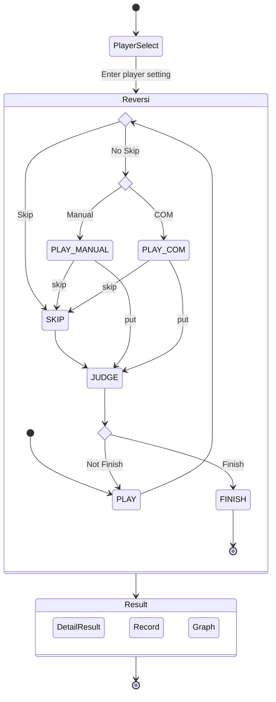

#  Reversi : リバーシ

**「Reversi : リバーシ」** はシンプルなリバーシのボードゲームです。

# 動作イメージ

## GUI 画面

## CUI 画面

# 特徴

* CUI と GUI の両方で動作します
* 人間 vs 人間、人間 vs COM、COM vs COM の対戦が可能です
* 棋譜を表示できます
* 対戦中の石の数の推移を、結果画面でグラフィカルに確認できます 

# 要件

「Windows 11 22H2」での動作することを確認しています。
他のOSでも動作可能と思われますが、未検証です。

本プログラムのプログラミング言語は Java を使用しています。
また、GUIフレームワークは JavaFX を使用しています。

* JDK 21
* Java FX 21

# 全体の状態遷移図

以下のように状態遷移します。

スキップ処理は原則、システム側で自動的に石を置く場所がないか探索し、場所がない場合のみ SKIP 状態になります。
ただし、プレイヤー側が正しく算出できなかった場合のために、プレイヤーから SKIP に遷移することもあります。

# 開発者情報

* komoto

# License

* [MIT license](https://en.wikipedia.org/wiki/MIT_License)
